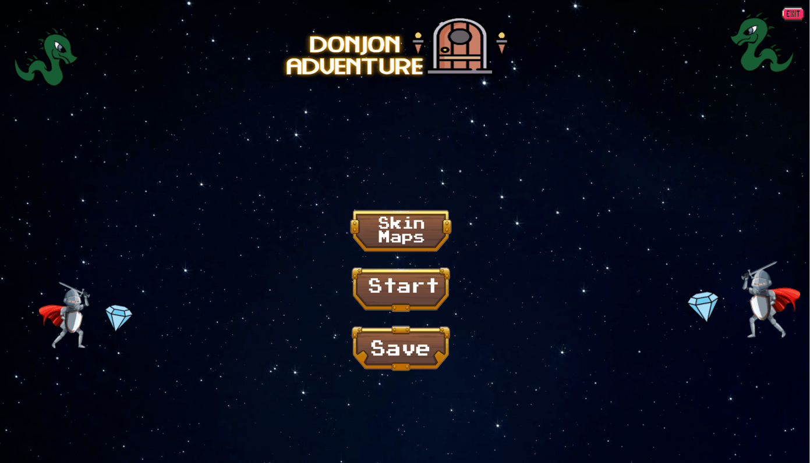
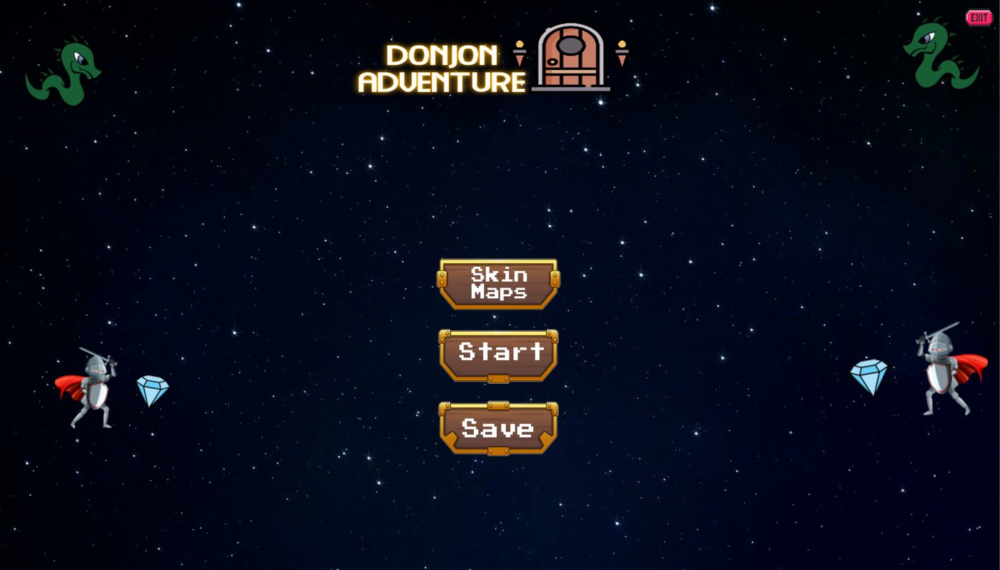

# Wall Is You

Wall Is You est un projet fin semestre L1 informatique, créer en python.

Ce jeu est une réinterprétation du scénario classique
dans lequel le joueur incarne un aventurier et doit s’engouffrer dans un donjon pour vaincre les créatures
maléfiques qui s’y trouvent. Dans Wall Is You, les rôles sont inversés : le joueur joue le rôle d’un donjon qui
doit aider un aventurier à trouver chemin à des monstres qui l’habitent. Le jeu alterne entre les tours du
donjon, contrôlé par le joueur, et les tours de l’aventurier, contrôlé par le programme.

## Demo

## Documentation

Le fichier main.py est le programme principal qui importe tous les autres programmes. Pour lancer le
jeu on utilise python3.

`python3 main.py`

La résolution de l'affichage par défault est de 1400x800. On peut la modifier via le terminale.

`python3 main.py 1980x1080`

&ensp; On peut jouer au différent type de donjon avec différentes type de texture en appuyant sur le boutton **Skin Maps**.

### Utilisation du jeu

La map dispose de plusieurs monstre avec differents niveau. L'aventurier peut tuer des monstres qui ont un niveau inferieur ou égale . A chaque fois qu'il tue un monstre l'aventurier monte d'un niveau. (Au début du jeu l'aventurier sera au niveau 1, par défault).
 

En appuyant sur une salle on peut la pivoter, a fin de créer le chemin de l'aventurier. Une fois la chemin crée , on peut levoir grâce à la ligne de l'intention.

Ce jeu dispose de plusieurs commande , qu'on peut utiliser grâce au clavier.

- `Enter` ou `Espace` pour avance vers la créature.
- `R` Pour réssayer.
- `S` pour sauvegarder la partie dans l'état actuelle.
- `H` pour aller au menu
- `Echap` pour quitter.

Une fois que l'aventurier a tué tous les monstres , il a gagne . Or si l'aventurier affronte un monstre plus fort que lui alors il meurt et la partie est perdue.

